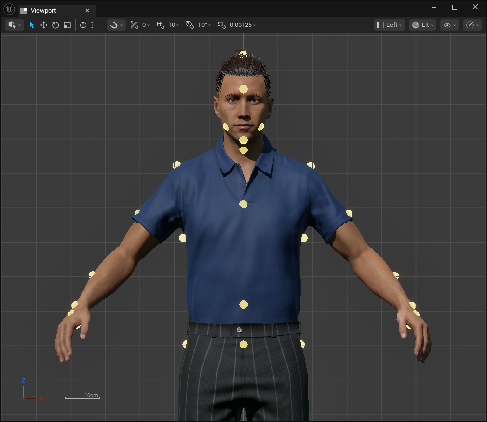
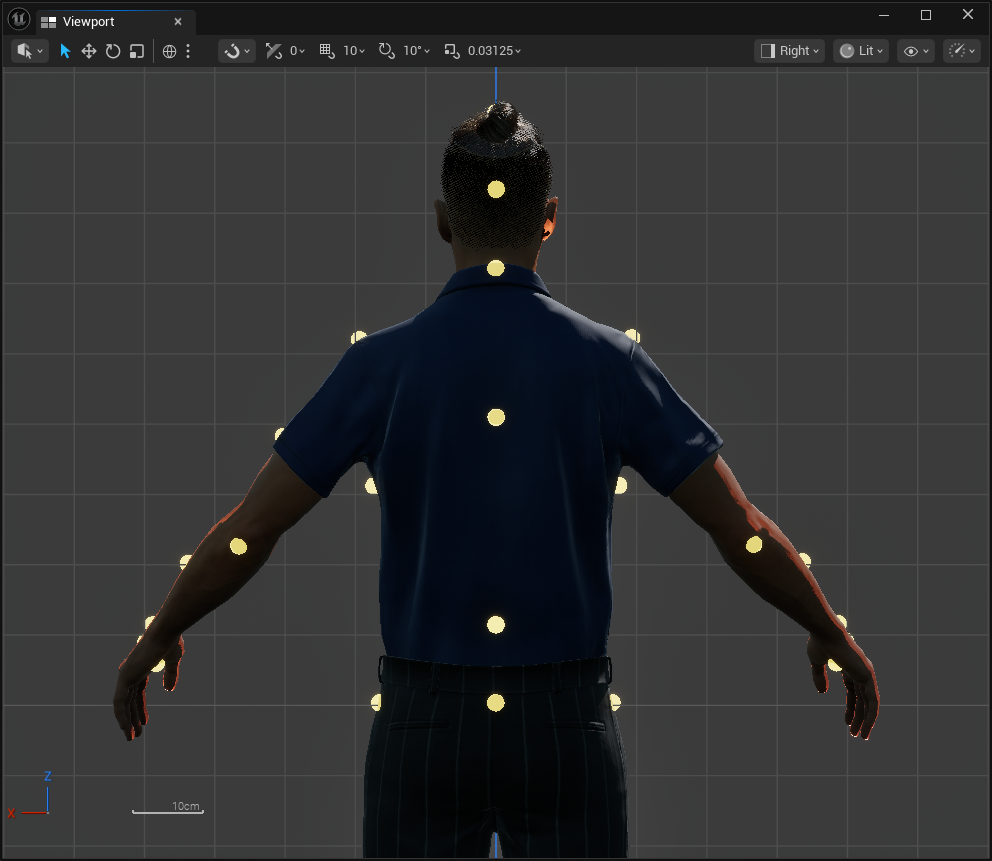
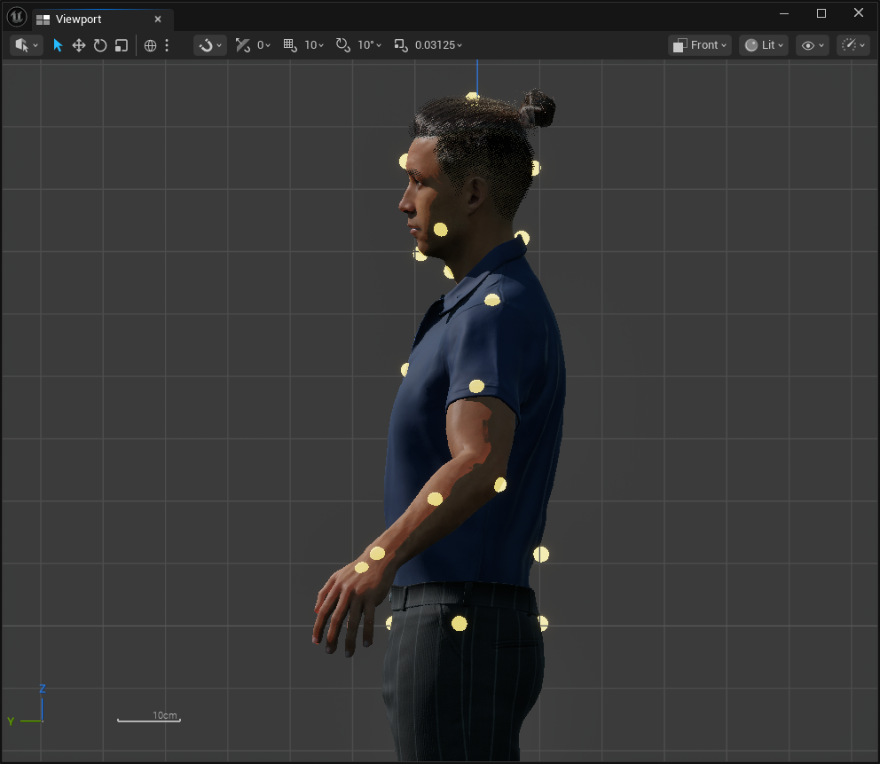
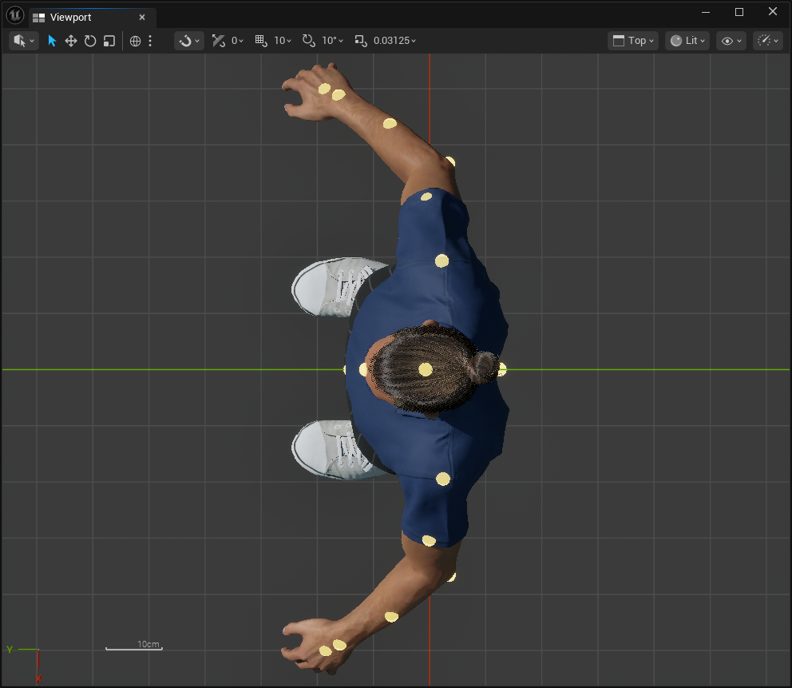

# Context Point Placement Guide

Place points on the mesh surface in the character's reference pose. Use the
same anatomical location on the source and target characters. The placement
does not need to match vertex topology.

Rotate each point so its local X axis points outward from the mesh. This normal
is used by the penetration descriptor. Unreal displays local X as the red arrow.
After positioning all points, press `Rotate Points To Surface Normals` to align
their red arrows automatically. The operation uses LOD 0 in the reference pose
and does not move the points.

## Pelvis and torso

| Point | Placement |
|---|---|
| `pelvisFront` | Center of the front pelvis, below the navel. |
| `pelvisBack` | Center of the back pelvis at the same height. |
| `pelvisLeft` | Left outer pelvis surface. |
| `pelvisRight` | Right outer pelvis surface. |
| `abdomenFront` | Front abdomen near the navel. |
| `abdomenBack` | Lower-back surface opposite `abdomenFront`. |
| `chestFront` | Center of the sternum. |
| `chestBack` | Center between or slightly below the shoulder blades. |
| `chestLeft` | Left lateral ribcage, below the armpit. |
| `chestRight` | Right lateral ribcage, below the armpit. |
| `neckFront` | Center front surface of the neck. |
| `neckBack` | Center back surface of the neck. |

## Head

| Point | Placement |
|---|---|
| `headTop` | Highest point of the scalp. |
| `forehead` | Center of the forehead. |
| `headBack` | Center rear surface of the skull. |
| `chin` | Front/lower surface of the chin. |
| `cheekLeft` | Most useful contact area of the left cheek. |
| `cheekRight` | Most useful contact area of the right cheek. |

## Arms and hands

Apply these instructions symmetrically to the `Left` and `Right` points.

| Point | Placement |
|---|---|
| `shoulder` | Outer deltoid surface. |
| `upperArm` | Outer upper-arm surface, approximately halfway to the elbow. |
| `elbow` | Outer elbow surface. |
| `forearm` | Forearm skin surface, approximately halfway between elbow and wrist. Do not leave it on the bone's rotation axis. |
| `wrist` | Wrist surface near the hand. |
| `palm` | Center of the palm. |
| `handBack` | Center of the back of the hand, opposite `palm`. |

`forearm`, `palm`, and `handBack` must be offset from their bone axes. Their
movement then exposes forearm twist and hand orientation to the solver.

## Placement checks

- Keep paired left/right points symmetrical where the mesh permits it.
- Put every point slightly above the surface rather than inside the mesh.
- Check the points from the front, side, and back.
- Play a preview animation and confirm that every point remains attached to its
  intended body region.
- Capture the points to the configuration again after moving or rotating them.

## Screenshots

Use all four views when checking whether a point is on the mesh surface.

| Front | Back |
|---|---|
|  |  |

| Side | Top |
|---|---|
|  |  |
